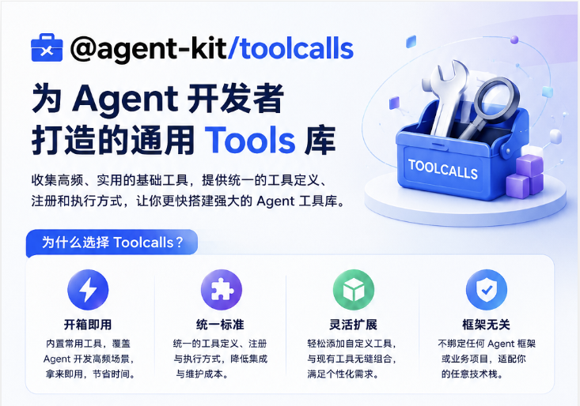

# @agent-kit/toolcalls

[English](./README.EN.md)



`@agent-kit/toolcalls` 是一个面向 Agent 开发的常用 Tools 集合库。

在开发 Agent 的过程中，经常需要反复实现一批基础工具：记忆读取、记忆写入、搜索、文件操作、HTTP 请求、数据库查询、知识库检索等。这个仓库的目标是把这些常用 tools 收集起来，并提供统一的工具定义、注册和执行方式，让你可以更快地搭建 Agent 的 tool 库。

这个包不绑定任何具体 Agent 框架，也不依赖某个业务项目。你可以在自己的 Agent runtime、OpenAI SDK、Anthropic SDK、Gemini SDK 或其他模型调用流程中使用它。

### 适合解决什么问题

- 快速复用 Agent 开发中常见的 tools。
- 用统一的 TypeScript 类型定义工具。
- 把同一批工具转换成不同模型厂商需要的 tools 结构。
- 通过工具名执行已经注册的原始工具函数。
- 避免每个 Agent 项目都重新写一套 tool registry 和 provider adapter。

### 核心思路

每个工具都有一个统一的原始结构：

```ts
export type Tool<TInput = Record<string, unknown>, TOutput = unknown> = {
  name: string;
  description: string;
  inputSchema: JsonSchemaObject;
  execute(input: TInput): Promise<TOutput> | TOutput;
};
```

然后通过：

```ts
registerTools([tool], provider)
```

完成两件事：

1. 把原始工具保存到内部 store，后续可以用 `execute_set(tool_name, input)` 执行。
2. 返回对应厂商需要的 tools 结构，例如 OpenAI、Anthropic、Gemini。

### 安装

```bash
npm install @agent-kit/toolcalls
```

### 快速开始

```ts
import {
  memoryListTool,
  execute_set,
  registerTools,
} from '@agent-kit/toolcalls';

const tools = registerTools([memoryListTool], 'openai');

const completion = await openai.chat.completions.create({
  model: 'gpt-4.1',
  messages,
  tools,
});

const toolCall = completion.choices[0]?.message.tool_calls?.[0];

if (toolCall) {
  const output = await execute_set(
    toolCall.function.name,
    JSON.parse(toolCall.function.arguments),
  );

  console.log(output);
}
```

### 运行流程

```text
从 @agent-kit/toolcalls 导入需要的工具
  -> 选择要注册的工具
  -> registerTools([tools], provider)
  -> 内部保存原始 Tool
  -> 返回当前 provider 的 tools 结构
  -> 把 tools 传给模型
  -> 模型返回 tool call
  -> execute_set(tool_name, input)
  -> 执行原始 Tool 的 execute 函数
```

### 当前支持的 Provider

```ts
type ProviderName = 'openai' | 'anthropic' | 'gemini';
```

不同厂商对 tool 的结构要求不同。这个包内部通过 factory 把统一的 `Tool` 转成目标厂商需要的结构。

### 当前内置工具

| Tool | 说明 |
| --- | --- |
| `memoryListTool` | 读取 Agent 可以使用的记忆列表。 |

后续可以继续增加：

- `memorySaveTool`
- `webSearchTool`
- `httpFetchTool`
- `fileReadTool`
- `knowledgeSearchTool`
- `databaseQueryTool`

### 使用自定义工具

如果你想给自己的 Agent 添加一个新工具，不需要修改这个 npm 包源码。

你只需要在自己的项目里做两件事：

1. 定义一个符合 `Tool` 类型的工具。
2. 把这个工具传入 `registerTools([tool], provider)` 完成注册。

示例：

```ts
import type { Tool } from '@agent-kit/toolcalls';
import {
  execute_set,
  registerTools,
} from '@agent-kit/toolcalls';

type SearchInput = {
  query: string;
};

type SearchOutput = {
  results: string[];
};

export const searchTool: Tool<SearchInput, SearchOutput> = {
  name: 'search',
  description: 'Search for information by query.',
  inputSchema: {
    type: 'object',
    properties: {
      query: {
        type: 'string',
        description: 'Search query.',
      },
    },
    required: ['query'],
    additionalProperties: false,
  },
  async execute(input) {
    return {
      results: [`Result for ${input.query}`],
    };
  },
};

const tools = registerTools([searchTool], 'openai');

const output = await execute_set('search', {
  query: 'agent tools',
});
```

这样，一个自定义工具就添加好了。

`registerTools` 会把 `searchTool` 保存到内部 store，并返回当前厂商需要的工具结构。后续模型调用这个工具时，再用 `execute_set('search', input)` 执行原始工具。

如果你有多个自定义工具，可以一次性注册：

```ts
const tools = registerTools([
  searchTool,
  readFileTool,
  webSearchTool,
], 'openai');
```
