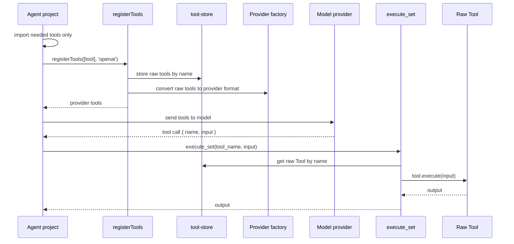

# Toolcalls Architecture

## First Version

The package is independent from `agent_server`.

```text
toolcalls/
├── package.json
├── tsconfig.json
├── README.md
└── src/
    ├── index.ts
    ├── types.ts
    ├── factories/
    ├── runtime/
    └── tools/
```

## Flow



## Boundary Rules

- `src/index.ts` must not import `src/tools/*`.
- `src/runtime/register-tools.ts` must not import `src/tools/*`.
- `src/runtime/execute-set.ts` must not import `src/tools/*`.
- `src/runtime/tool-store.ts` must not import `src/tools/*`.
- Tools are only loaded when users import their subpath.
- `registerTools()` only handles the tools passed by the user.
- `execute_set()` only executes tools already stored by `registerTools()`.
