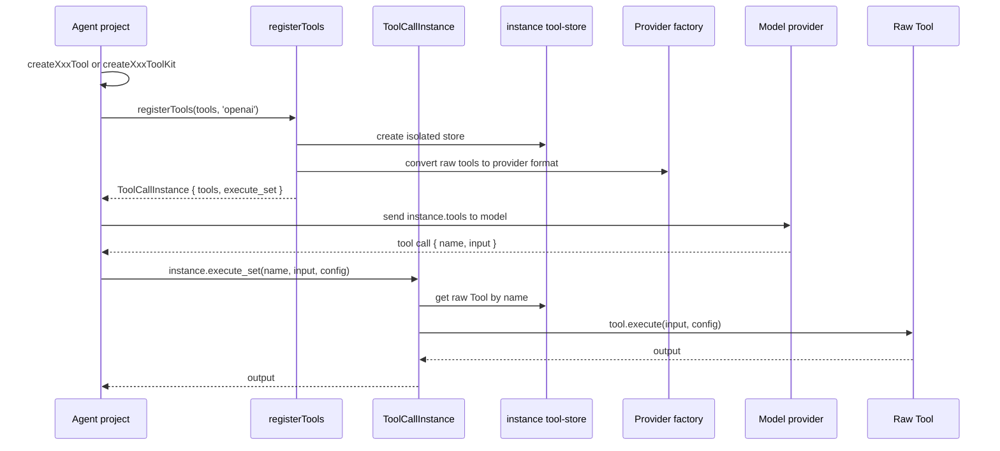

# Toolcalls Architecture

## First Version

The package is independent from `agent_server`.

```text
toolcalls/
├── package.json
├── tsconfig.json
├── README.md
└── src/
    ├── index.ts
    ├── types.ts
    ├── factories/
    ├── runtime/
    └── tools/
```

## Flow



## Config Precedence

Tools can read configuration from three places:

1. Runtime config passed to `instance.execute_set(toolName, input, config)`.
2. Create-time config passed to `createXxxTool(config)`.
3. Environment variables.

Precedence:

```text
execute_set config > createXxxTool config > environment variables
```

## Instance Isolation

`registerTools()` does not write to a global store. Every call creates a
separate `ToolCallInstance`, so the same tool names can be registered in
different instances without conflicts.

## Boundary Rules

- `src/index.ts` may re-export the generated `src/tools/index.ts`.
- `src/runtime/register-tools.ts` must not import `src/tools/*`.
- `src/runtime/execute-set.ts` must not import `src/tools/*`.
- `src/runtime/tool-store.ts` must not import `src/tools/*`.
- `src/tools/index.ts` is generated from every `src/tools/*/index.ts`.
- Public tool exports are re-exported from `@agent-kit/toolcalls`.
- `registerTools()` only handles the tools passed by the user.
- `instance.execute_set()` only executes tools registered in that instance.
